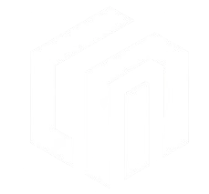

# Gianluca Meneghetti

### 👨‍💻 Machine Learning Engineer | Milan, Italy

Welcome to the **freaking best** personal portfolio on GitHub! I'm Gianluca Meneghetti, a Machine Learning Engineer who doesn't just think outside the box—I destroy the box. Whether it's Computer Vision, Deep Learning, or making Transformers dance, I'm here to show you what cutting-edge AI looks like.

## 🛠️ My Arsenal of Skills

> **"Machine learning is not just a skill—it's an art."**

### **Core Competencies**

- **Machine Learning**: Turning data into gold—Supervised & Unsupervised Learning, Model Evaluation, Feature Engineering
- **Computer Vision**: Object Detection, Image Classification, Segmentation
- **Deep Learning**: The neural network whisperer—CNNs, Transfer Learning, Generative Models
- **NLP & Transformers**: BERT, GPT, ViT
- **Programming Languages**: Python (my sword), SQL (my shield)
- **Tools & Frameworks**: TensorFlow(+ TF Models), Keras, OpenCV, Scikit-learn, Hugging Face, Pandas, Numpy
- **Data Visualization**: Matplotlib, Seaborn, Plotly
- **Cloud & DevOps**: AWS Cloud Practitioner, AWS ML Specialist (loading… 🔃)

## 🚀 Projects That Redefine Awesome

### **1. Malaria Detection with Deep Learning** 🌟     
- **💡 Description**: A deep learning model trained to detect malaria-infected cells in microscopic images with high accuracy, utilizing CNNs and TensorFlow.
- **🔗 Repository**: [View on GitHub](https://github.com/Menego23/Malaria_detection_LeNet)

*Stay tuned—more groundbreaking projects coming soon...*

## 📦 Additional Work & Contributions

Many of the impactful projects I have worked on are part of my professional engagements and thus not included here. However, these projects illustrate the type of work I excel in and am passionate about. 

## 🎓 Certifications & Ongoing Mastery

- **AWS Cloud Practitioner** 🟢
- **AWS Machine Learning Specialist** (In Progress 🔄)
- **Hugging Face Transformer Models** 

## 🔥 The Hot List

- **Currently Learning**: Machine Learning Design Pattern
- **Next Big Thing**: NLP in Depth

## 🏆 Quote

> _"Mastery requires lots of practice. But the more you practice something, the more boring and routine it becomes.
Thus, an essential component of mastery is the ability to maintain your enthusiasm. The master continues to find the fundamentals interesting."_

- **James Clear**

## 💬 Hit Me Up!

I’m always open to connecting with fellow innovators, disruptors, and tech rebels. Drop me a line, challenge me, or just say hi:

- **Email**: gianluca.meneghetti@outlook.com
- **LinkedIn**: [Gianluca Meneghetti](https://www.linkedin.com/in/gianluca-meneghetti-3b520325b/)
- **GitHub**: [Menego23](https://github.com/Menego23)
- **YouTube**: [NeuralFlare](https://www.youtube.com/@NeuralFlare)

## 💡 Final Thought

Life is too short for boring README files. Welcome to the **future** of machine learning portfolios. Thank you for visiting, and remember:

> "The best way to predict the future is to create it."

**P.S.** If you’ve read this far, you’re awesome. Let’s connect and make something incredible together! 🚀
